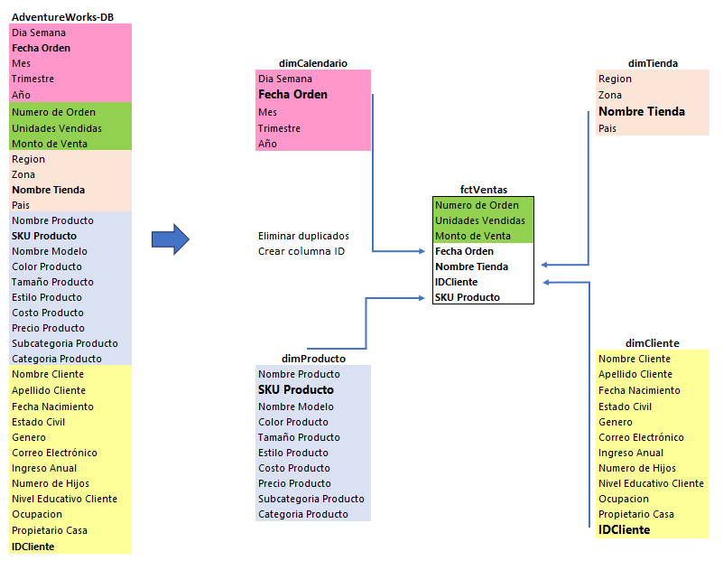

# Modelo de datos estrella en Power BI con una tabla de hechos

El modelo estrella es una estructura de datos que organiza los datos en dimensiones y medidas para facilitar la visualización y el análisis de los resultados.

## 1. Carga de Datos
En esta fase, se carga la información necesaria para el análisis de dimensiones factores. Esto incluye la recopilación de datos relevantes y su organización en un formato adecuado para el análisis.

## 2. Identificación de Tablas y Dimensiones
En esta fase, se identifican las tablas y dimensiones relevantes para el análisis. Esto implica la clasificación de los datos en categorías significativas para facilitar la comprensión y el análisis de los resultados.

## 3. Creación del Modelo Estrella en Power BI
En esta fase, se crea un modelo estrella en Power BI utilizando Power Query para visualizar y analizar los datos. 

